# EKS Terraform AWS Project DEMO

## 📌 Project Overview
I designed this project to **automate the deployment of an Amazon Elastic Kubernetes Service (EKS) cluster** using **Terraform**. I also deployed an **OpenTelemetry demo application**, leveraging **Docker and Kubernetes** for a scalable, monitored microservices environment.

The project demonstrates **Infrastructure as Code (IaC)**, **containerization**, and **observability** using **OpenTelemetry**.

## 🎯 Objectives
- Automate **EKS cluster deployment** using **Terraform**
- Deploy a **sample OpenTelemetry demo application**
- Implement **containerized services** using **Docker & Kubernetes**
- Enable **monitoring & observability** using OpenTelemetry
- Use **multi-stage Docker builds** for optimized security & efficiency
- Deploy an **Ingress Controller for advanced traffic routing**

## ⚙️ Installation & Setup
### **Prerequisites**
Before running the project, I ensured I had the following installed:

- **Terraform** (>= 1.2.0)
- **AWS CLI** (configured with necessary IAM permissions)
- **kubectl** (for managing Kubernetes resources)
- **Docker** (for building & running containerized applications)
- **Helm** (for package management in Kubernetes)

### **Steps I Followed to Deploy the Infrastructure**
1. **Cloned the repository**
```sh
git clone https://github.com/jomaa-ahmed/Eks-terraform-aws-Project.git
cd Eks-terraform-aws-Project
```
2. **Initialized Terraform**
```sh
terraform init
```
3. **Applied Terraform Configuration**
```sh
terraform apply -auto-approve
```
4. **Retrieved Kubernetes Configuration**
```sh
aws eks --region <your-region> update-kubeconfig --name <cluster-name>
```

## 🚀 Running the Project
Once the EKS cluster was up and running, I accessed the **OpenTelemetry Demo application**:

### **Homepage Preview**


The homepage of the OpenTelemetry demo application was accessible at:
```
http://<public-ip>:8080
```

### **Product Page Preview**
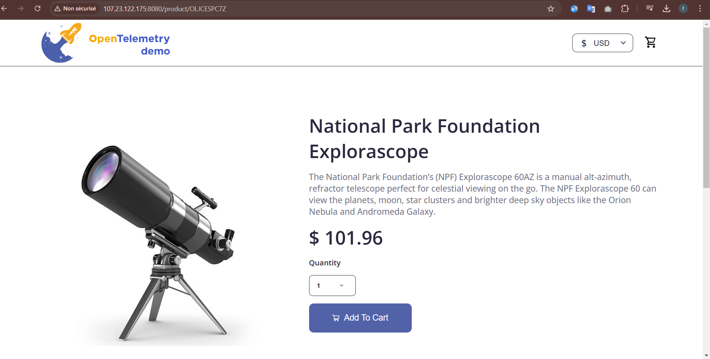

## 🐳 Docker & Deployment
I containerized the application services using **Docker** and deployed them using **Docker Compose**.

### **Starting All Services**
```sh
docker compose up -d
```

#### **Docker Compose Running Services**
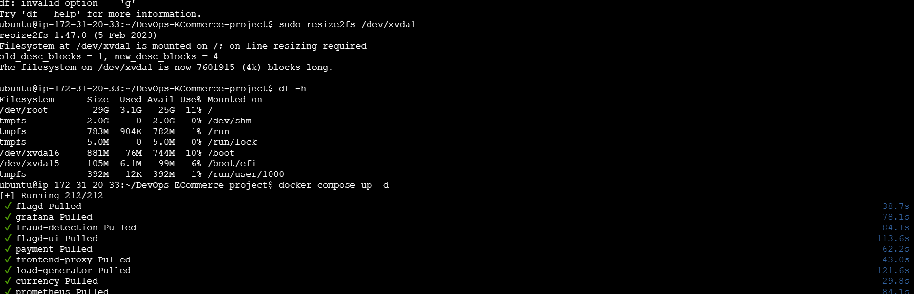

### **Golang-based Microservice (Product Catalog)**
I built the backend service using **Golang** and implemented a **multi-stage Docker build** for efficiency.

#### **Dockerfile for Golang Service**
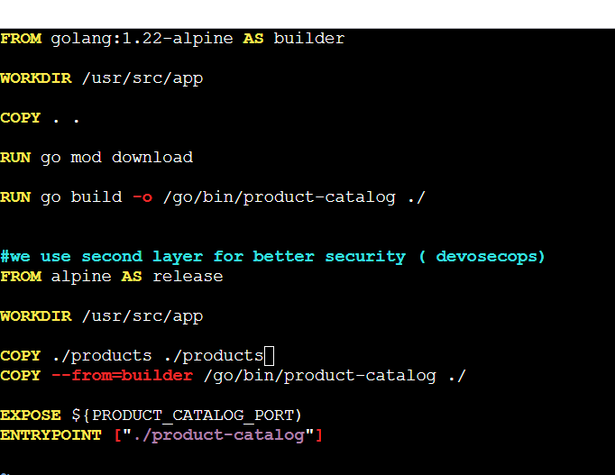

### **Java-based Microservice (Ad Service)**
I built an **advertisement service** using Java and Gradle with a **multi-stage Docker build**.

#### **Dockerfile for Java Service**


### **Python-based Microservice (Recommendation Service)**
I built a **recommendation service** using Python.

#### **Dockerfile for Python Service**
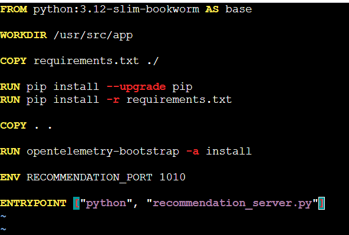

### **Re-running Docker Compose**
```sh
docker compose up -d
```

#### **Updated Docker Compose Running Services**
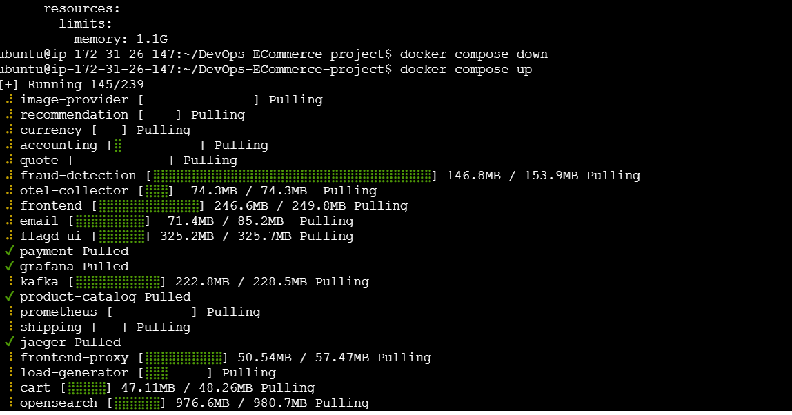

## 🌍 Terraform State Management with S3 & DynamoDB
I used **Amazon S3** and **DynamoDB** to store and manage the Terraform state files securely.

### **Terraform S3 Bucket Configuration**
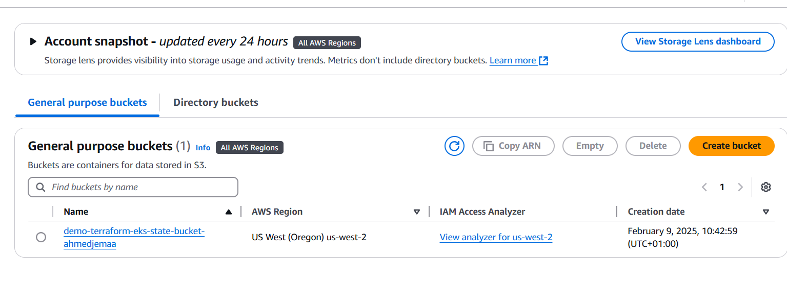

### **Main Terraform Configuration (`main.tf`)**
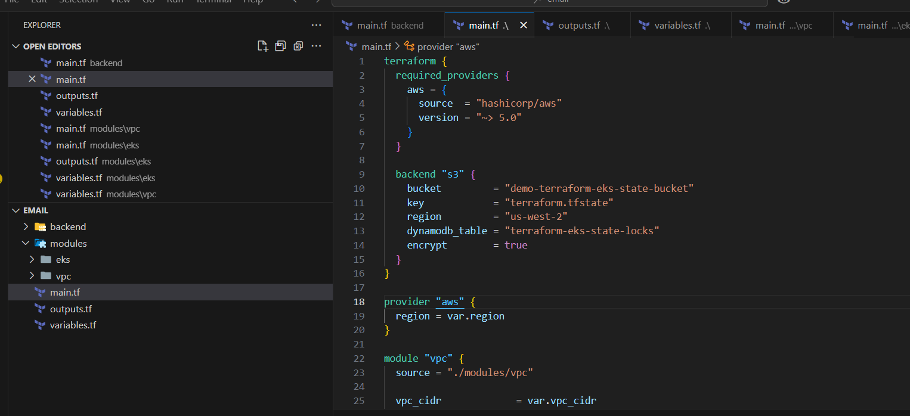

### **Initializing Terraform with S3 Backend for EKS**
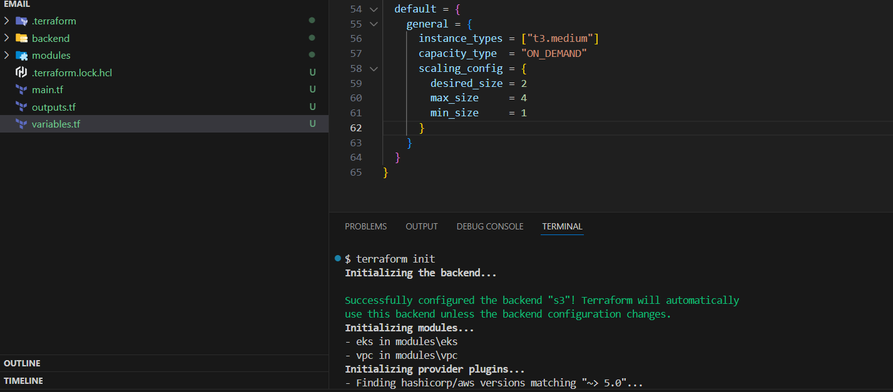

### **Terraform Plan for Creating EKS**
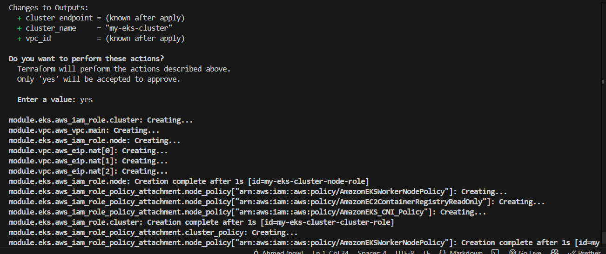

### **`kubectl get nodes` Output Before Configuring EKS**
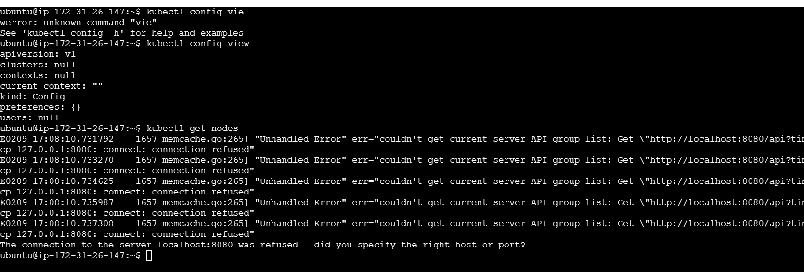

### **Terraform Deployment Completed**
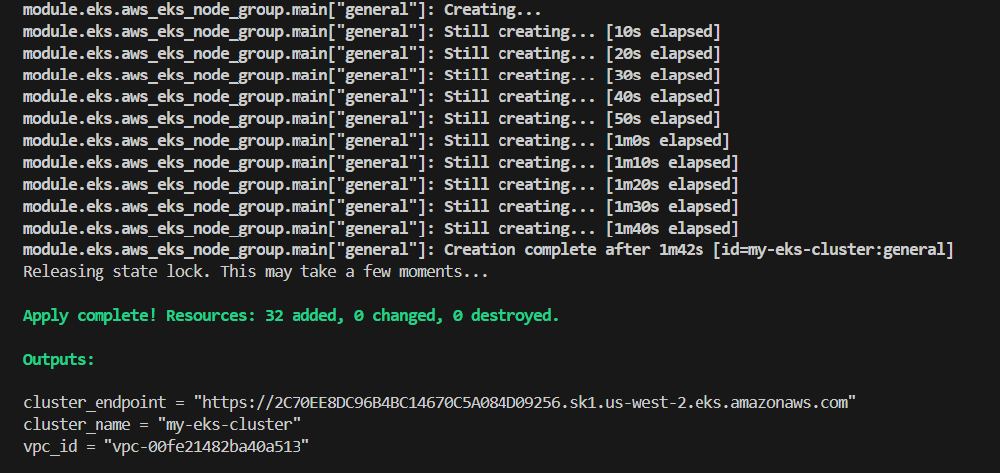

### **AWS CLI Version Verification**
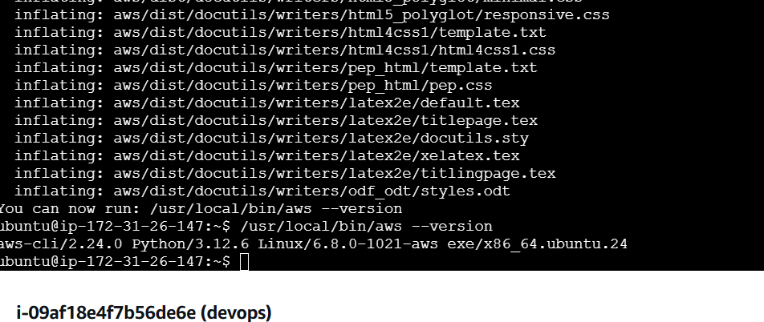

### **`kubectl get nodes` Output After Configuring EKS**
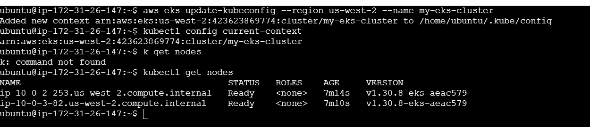

### **Creating Kubernetes Service Account for OpenTelemetry**
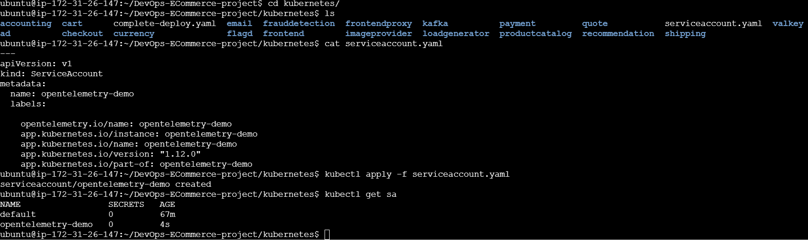

### **Checking Kubernetes Services and Pods**
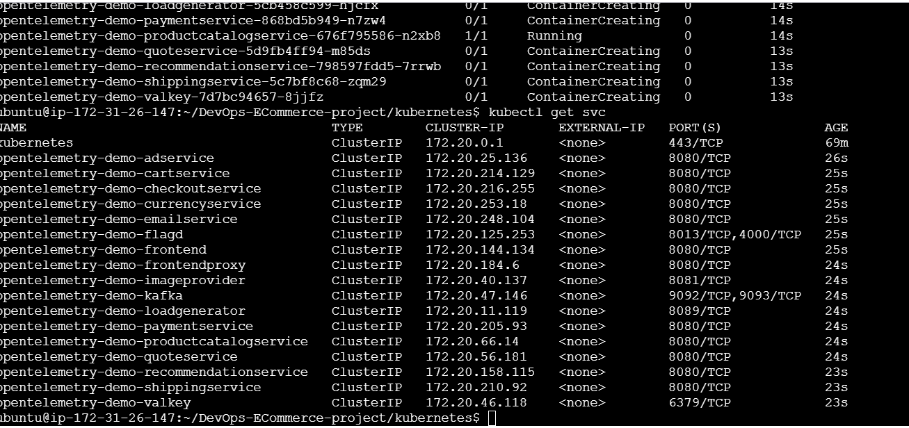

### **Deploying Ingress Controller & LoadBalancer**


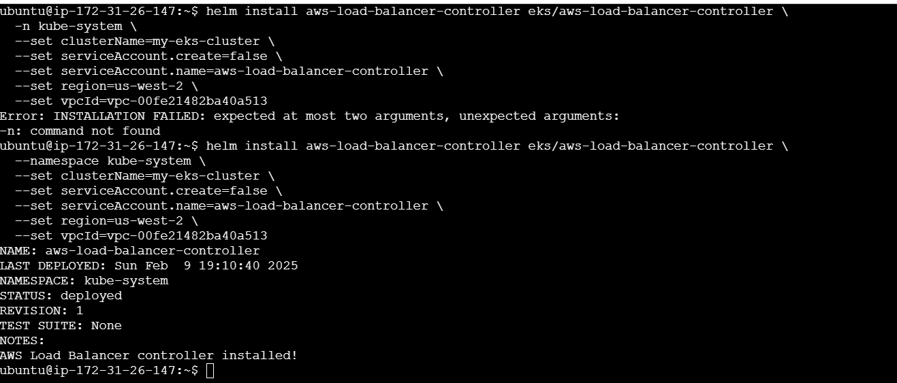

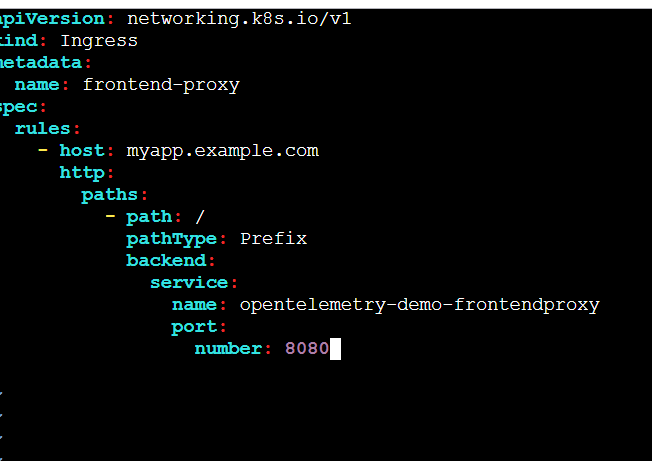

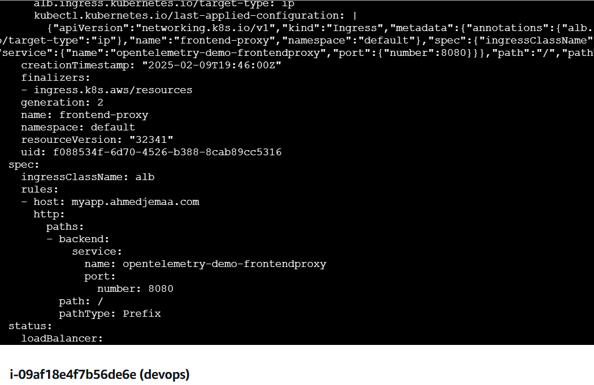

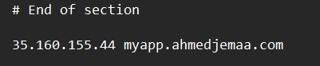

### **Final Hosted Application**
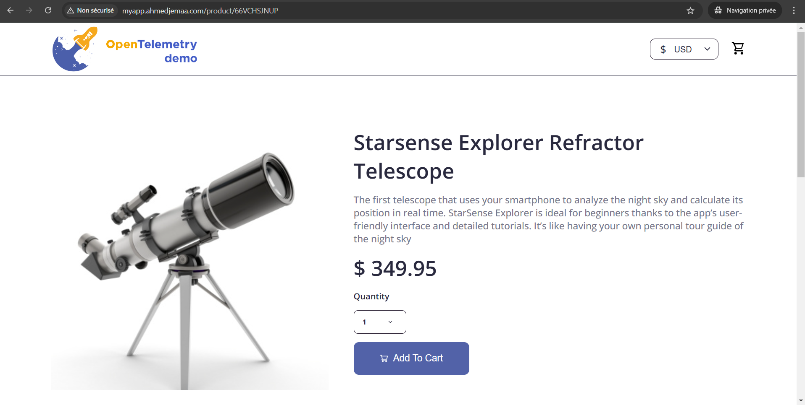

## 🔥 Key Technologies Used
- **AWS EKS** (Managed Kubernetes Cluster)
- **Terraform** (Infrastructure as Code)
- **Kubernetes** (Container Orchestration)
- **Docker** (Containerization)
- **Helm** (Kubernetes Package Management)
- **AWS Load Balancer** (Traffic Management)

## 📝 Summary
This project demonstrates how I automated **Kubernetes infrastructure provisioning**, **deployed microservices**, and **integrated observability** using best practices. It showcases hands-on experience in **EKS, Terraform, Ingress Controllers, and Observability**, which is highly relevant for **Cloud-Native DevOps roles**.
